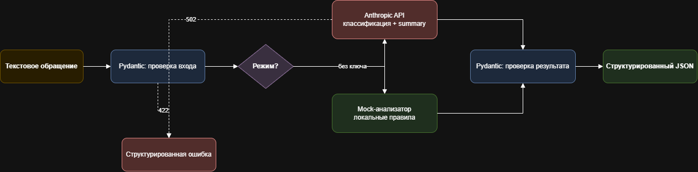

# AI Text Intake Agent

Выбран кейс 1: AI-агент для обработки текстовых обращений. Сервис принимает текст, определяет тип и приоритет запроса, делает краткое резюме и возвращает структурированный JSON.

## Что работает

- `POST /analyze` с валидацией входа;
- классификация и суммаризация через Anthropic API;
- строгий structured output на основе Pydantic-модели;
- автоматический mock-режим без API-ключа;
- обработка ошибок Anthropic API;
- интерактивная проверка через Swagger UI;
- тесты без реальных сетевых запросов.

## Что замокано

В mock-режиме нет вызова LLM: категория определяется по небольшому набору ключевых слов, а summary строится из первого предложения. CRM, база данных и внешние уведомления не реализованы, поскольку они не входят в выбранный кейс.

## Что находится в репозитории

- рабочий Python-прототип в `app/`;
- зависимости в `requirements.txt` и `requirements-dev.txt`;
- шаблон переменных окружения `.env.example`;
- редактируемая flow-схема `docs/flow.drawio`;
- примеры входа и выхода в `examples/`;
- автоматические тесты в `tests/`.

## Flow-схема



Редактируемая схема: [`docs/flow.drawio`](docs/flow.drawio). Файл открывается в [diagrams.net](https://app.diagrams.net/).

## Стек

- Python 3.11+
- FastAPI и Pydantic
- официальный Anthropic Python SDK
- pytest

## Запуск

```bash
python -m venv .venv
# Windows
.venv\Scripts\activate
pip install -r requirements.txt
copy .env.example .env
uvicorn app.main:app --reload
```

Откройте `http://127.0.0.1:8000/docs` и выполните `POST /analyze`.

По умолчанию `ANALYZER_MODE=auto`: при наличии `ANTHROPIC_API_KEY` используется Anthropic, иначе mock. Для принудительного режима установите `ANALYZER_MODE=anthropic` или `ANALYZER_MODE=mock`.

Модель задаётся в `.env`:

```dotenv
ANTHROPIC_API_KEY=your-key
ANTHROPIC_MODEL=claude-haiku-4-5-20251001
```

## Пример запроса

```bash
curl -X POST http://127.0.0.1:8000/analyze ^
  -H "Content-Type: application/json" ^
  -d "{\"text\":\"Не могу войти в личный кабинет после смены пароля.\"}"
```

```json
{
  "text": "Не могу войти в личный кабинет после смены пароля."
}
```

## Пример ответа

```json
{
  "category": "technical_issue",
  "priority": "high",
  "summary": "Клиент не может войти в личный кабинет после смены пароля",
  "needs_human": true,
  "confidence": 0.94
}
```

Ответ содержит заголовок `X-Analysis-Provider: anthropic` или `mock`, чтобы режим можно было проверить без изменения JSON-контракта.

## Тесты

```bash
pip install -r requirements-dev.txt
pytest -q
```

Тесты используют dependency override FastAPI и не отправляют данные в Anthropic.

## API-контракт

Категории: `technical_issue`, `billing`, `sales`, `complaint`, `general`.

Приоритеты: `low`, `medium`, `high`.

Ограничения входа: от 3 до 5000 символов. Ошибка входной валидации возвращает HTTP 422, ошибка AI-провайдера — HTTP 502 со структурированным `detail`.
